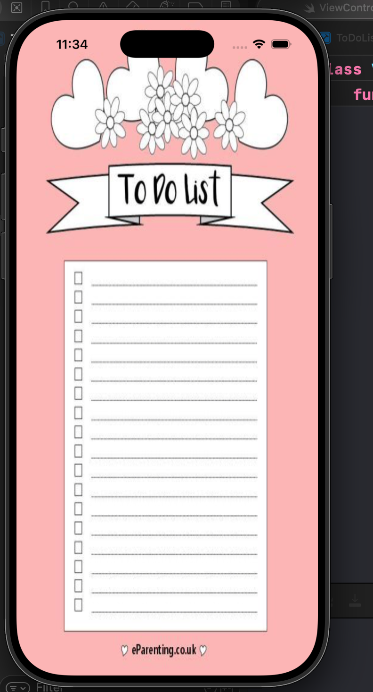
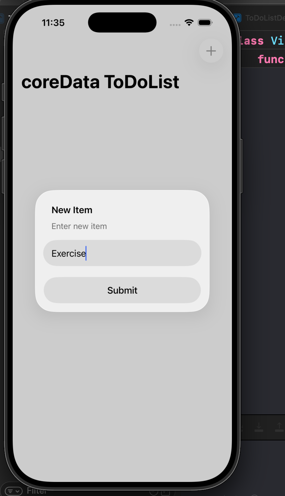
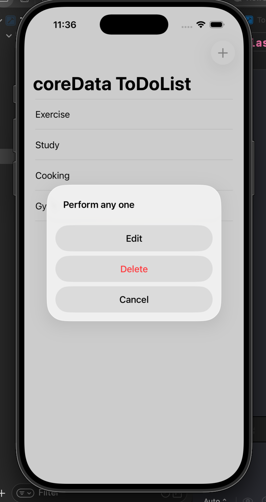

# TaskMaster 📝


> todo-list is a TaskMaster,an intuitive to-do list app crafted in Swift and backed by Core Data. Combining robust features with a sleek, user-friendly design, it helps you efficiently manage your tasks and stay on top of your daily routines.

---

## 📱 Screenshots

| Loading Screen | Add Task | Edit Task |
|:---:|:---:|:---:|
|  |  |  |

---

## ✨ Features

* **Task Management:** Easily create, edit, and delete tasks.
* **Data Persistence:** Uses **Core Data** so your tasks are saved even when you close the app.
* **User Interface:** Clean and simple iOS design.

---

## 🛠 Tech Stack

* **Language:** Swift
* **Storage:** Core Data
* **IDE:** Xcode

---

## 🚀 How to Run

1.  Clone the repository:
    ```bash
    git clone [https://github.com/git-Satyajit/todo-list.git](https://github.com/git-Satyajit/todo-list.git)
    ```
2.  Open the project folder and double-click the `.xcodeproj` file.
3.  Build and run the app in the Xcode Simulator.
